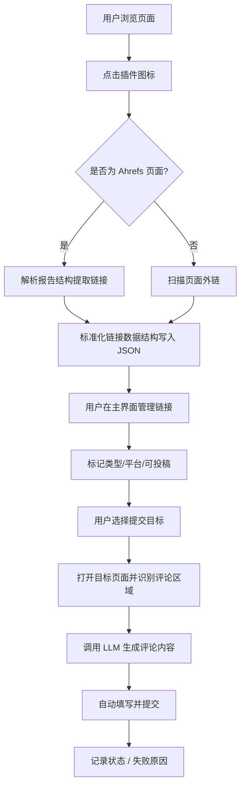

# LinkPilot 插件应用流程文档

---

## 一、总览

本流程文档描述了 LinkPilot 插件覆盖的完整操作路径，从外链采集到提交完成，分为三个阶段：

1. 外链收集
2. 外链管理
3. 外链提交

每个阶段均配合用户行为、插件动作、自动化处理逻辑进行分解，并结合交互状态与数据结构演进。

---

## 二、流程阶段拆解

### 2.1 外链收集阶段

**用户操作：**

* 用户浏览任意页面或 Ahrefs 报告页
* 点击插件图标，激活“采集外链”操作

**插件动作：**

* 识别当前页面是否为 Ahrefs 报告页，执行专用 DOM 提取逻辑
* 若为普通页面，则抓取所有 `<a href>` 外链

  * 过滤规则：去除本站链接、非 http(s)、锚点链接、重复链接
  * 标记 DoFollow / NoFollow
* 可选：用户导入 CSV 文件触发解析与数据清洗

**输出结果：**

* 每条链接形成标准 JSON 结构，写入本地存储
* 每条外链自动赋予初始状态 `未处理`，类型待人工分类

---

### 2.2 外链管理阶段

**用户操作：**

* 在插件主界面中查看已采集外链
* 筛选、搜索、标记链接类型（博客 / 论坛 / 目录等）
* 设置平台（如 WordPress / Disqus / 其他）
* 添加行业标签、手动备注
* 更新每条链接的“可投稿性”字段

**插件支持能力：**

* 自动识别外链目标平台（基于页面 DOM 特征）
* 提供筛选器、导出按钮等操作能力
* 保存外链更新后的状态（成功 / 忽略 / 跳过 / 无入口）

**输出结果：**

* 结构化外链库：支持后续筛选投放渠道
* 标记“已处理”或“待提交”状态的清单

---

### 2.3 外链提交阶段

**用户操作：**

* 在管理界面中选定目标外链，进入提交流程
* 确认提交站点信息（站点名、主域、标签、行业）
* 选择评论风格（可选）

**插件动作：**

* 打开目标链接页面（新 tab 或后台）
* 自动识别评论区或表单区（平台识别 + DOM 推理）
* 抽取页面主要内容，调用大语言模型生成评论
* 自动填充评论内容 / 提交表单
* 记录提交时间、状态、失败原因（如有）

**输出结果：**

* 外链状态更新为“已提交 / 成功 / 失败”
* 日志记录失败原因，供后期筛查
* 全过程任务完成度可追踪

---

## 三、流程图（概念图）

---